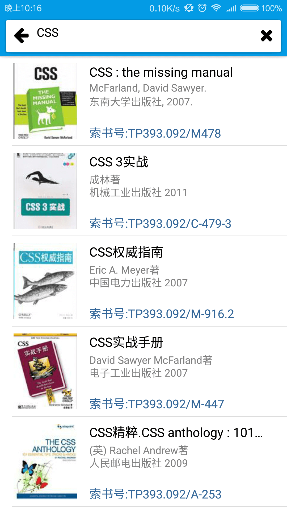

# tool-sets

工具集，该项目主要是集成一些生活常用到的一些小工具

## 安装

### 方法一

+ 直接安装[打包好的apk文件](https://yunpan.cn/cvKzBmDhKm8yD)(访问密码 **b6d0**，不是最新版）

### 方法二

+ 本项目采用react-native框架构建，首先需要[安装react-native环境](http://reactnative.cn/docs/0.31/getting-started.html#content)
+ 执行`npm install`命令，安装项目中用到的模块
+ 执行`react-native start`命令运行Packger，将资源进行打包
+ 执行`react-native run-android`命令编译并安装应用到手机上

## 功能

### 已实现

+ 聊天窗口界面
+ 使用百度语音API进行语音识别
+ 使用图灵机器人API进行基本的对话
+ 将对话记录进行存储
+ 功能选择界面
+ 设置界面
+ 清除聊天记录功能
+ 快递查询功能
+ 图书馆书籍查询

### 未实现

+ 图书馆书籍查询，拥有保存历史查询记录功能
+ 图书馆书籍查询，当上一次与当前查询关键字相同时不进行查询，使用上一次查询结果
+ 图书馆书籍查询，长列表优化
+ 图书馆书籍查询，处理网络连接失败错误
+ 图书馆书籍查询，高级搜索功能
+ 图片本地存储
+ 豆瓣高分电影推荐
+ 等等……

### 未解决BUG

+ `ToastAndroid.show()`的`duration`参数无效
+ 快递查询在无网络的情况下会报错，导致应用强行退出
+ 快递接口问题

## 各功能实现理由

### 快递查询
就是一个字，懒，懒得去百度一个快递查询网站，然后输入单号去查询，直接集成到工具里面方便查询 

### 图书馆书籍查询
图书馆虽然有电脑能查询书籍，但是，电脑就那么几台，有时还有可能某台电脑故障什么的，导致，能用来查询的更少了，而且用图书馆的电脑查了，之后的索书号也是一长串难以记忆的字符，往往都是电脑查后用手机拍下来，再去查询。所以有这个功能后就能随时随地查询了，而且省去了用电脑这一个中间步骤

### 豆瓣高分电影推荐
平时偶尔想看电影，不知道该看什么，基本都会去豆瓣看看有什么电影值得看，做这个的原因是懒得去网站看，直接集成到工具里面方便查看

## 使用截图

